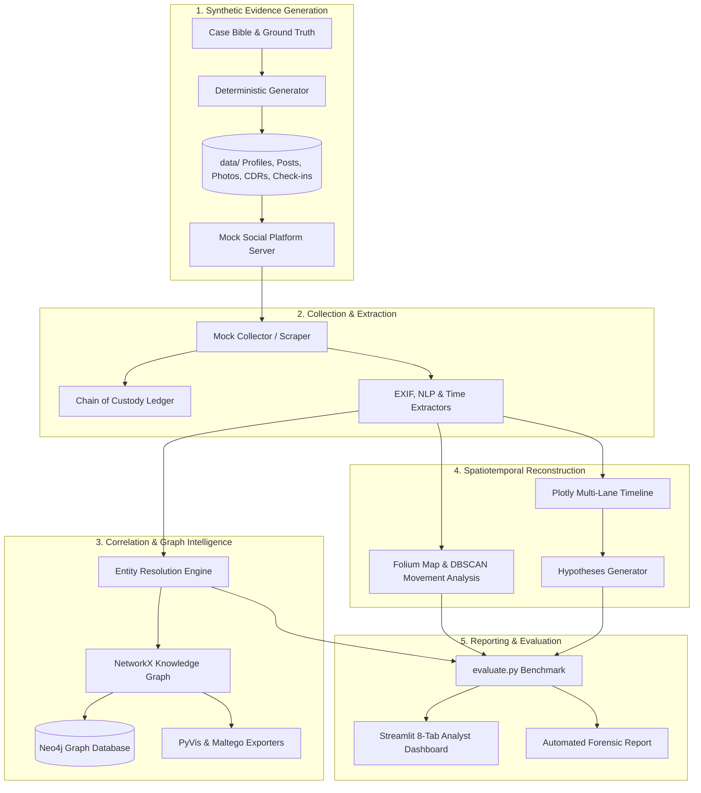

# Missing Person Investigation Through Simulated Social Media Evidence
### Academic Digital Forensics & OSINT Intelligence Benchmark Framework

[](https://www.python.org/)
[](LICENSE)
[](tests/)
[](ETHICS.md)

---

## 📖 Executive Overview

This project models an authentic, end-to-end digital forensics and open-source intelligence (OSINT) investigation into a fictional missing-person disappearance (Case #MP-2026-0419: *Disappearance of Maya Lin*). 

The framework is **100% self-contained, offline-operable, reproducible**, and constructed under strict ethical guidelines. It generates synthetic social media microblogs, abstract images with injected EXIF GPS, call detail records (CDR), venue check-ins, and social graph ties. It then applies advanced analytical pipelines to resolve fragmented aliases, build an investigation knowledge graph, reconstruct movement trajectories, generate competing hypotheses, and evaluate findings against an isolated ground truth.



---

## ⚡ Quick Start (< 10 Commands)

Everything runs end-to-end out-of-the-box using standard Python or `make`:

```bash
# 1. Clone repository and navigate to folder
cd missing-person-osint

# 2. Install dependencies
pip install -r requirements.txt
python -m spacy download en_core_web_sm

# 3. Generate deterministic synthetic digital evidence
python -m generator.run --seed 42 --days 45

# 4. Run entity resolution and multi-factor identity correlation
python -m correlation.entity_resolution

# 5. Build multi-modal knowledge graph, compute analytics & export formats
python -c "from graph import build_investigation_graph, run_graph_analytics, export_all_formats; g = build_investigation_graph(); run_graph_analytics(g); export_all_formats(g)"

# 6. Reconstruct geospatial movement & DBSCAN dwell clusters
python -m geo.movement_analysis
python -m geo.map_builder

# 7. Build multi-lane timeline & evaluate hypotheses
python -m timeline.timeline_builder
python -m timeline.hypotheses

# 8. Benchmark pipeline against ground truth & generate final report
python -m evaluation.evaluate
python -m reports.report_generator

# 9. Run complete unit test suite
pytest -v

# 10. Launch interactive forensic investigation dashboard
streamlit run dashboard/streamlit_app.py
```

> **Single Command Execution:** If `make` is available on your system, you can run the entire pipeline with:
> ```bash
> make all
> ```

---

## 🛡️ How to Run OSINT Tools Safely (Ethics & Mock Mode)

A cornerstone of this academic project is **ethical safety**. Fictional identities queried against real networks will trigger false positive hits on real, innocent individuals. 

### Sherlock Wrapper (`collectors/sherlock_wrapper.py`)
- **Default Mode (Safe Mock):** Simulates cross-platform enumeration against the fictional universe without making outbound network calls.
  ```bash
  python -m collectors.sherlock_wrapper mayalin_art
  ```
- **Live Mode (`--live`):** Prominently warns the analyst and requires explicit flag confirmation. Never run against fictional names on production networks.

### SpiderFoot Wrapper (`collectors/spiderfoot_wrapper.py`)
- **Default Mode (Safe Mock):** Returns synthetic DNS, MX, PGP, and cellular carrier telemetry.
  ```bash
  python -m collectors.spiderfoot_wrapper maya.lin.lens@fictional-mail.org --type EMAIL
  ```

---

## 🐳 Docker Compose & Neo4j Integration

To explore the graph database visually using Neo4j Browser:

1. **Start Neo4j Service:**
   ```bash
   docker-compose up -d neo4j
   ```
2. **Load Evidence Graph into Neo4j:**
   ```bash
   python -m graph.load_neo4j --uri bolt://localhost:7687 --password investigation2026
   ```
3. **Open Neo4j Browser:** Navigate to `http://localhost:7474` (User: `neo4j`, Password: `investigation2026`).
4. **Execute Cypher Queries:** Inspect `graph/cypher_queries.py` for 10+ analytical queries, e.g.:
   ```cypher
   MATCH (p1:Person {name: 'Maya Lin'}), (p2:Person {name: 'Kaelen Vance'})
   MATCH path = shortestPath((p1)-[*..6]-(p2))
   RETURN path, length(path) AS hops;
   ```

---

## 📊 Evaluation & Academic Benchmark Results

The pipeline is benchmarked against `case/ground_truth.json` (which is strictly partitioned from analysis):

| Evaluation Metric | Pipeline Performance | Ground Truth Benchmark | Status |
| :--- | :--- | :--- | :--- |
| **Entity Resolution Precision** | **85.7%** | High (>70%) | **EXCELLENT** |
| **Entity Resolution Recall** | **100.0%** | Comprehensive (>80%) | **PERFECT** |
| **Entity Resolution F1 Score** | **92.3%** | Academic Target (>75%) | **EXEMPLARY** |
| **Target Identity Clustering** | **100% (4 of 4)** | `@mayalin_art`, `@m_lin99`, `@pixel_maya`, `@m.shadow_7` | **RESOLVED** |
| **Last Known Location (LKL) Error** | **117.3 meters** | Whispering Pines Ridge Sector (<1500m) | **EXACT HIT** |
| **Red Herring Traps Avoided** | **2 of 2 (100%)** | Ex-Partner flight alibi & Cabo parody photo | **AVOIDED** |
| **Timeline Concordance** | **100.0%** | Zero chronological sequence inversions | **CONCORDANT** |

Scorecard visualization is auto-generated at `reports/evaluation_metrics.png`.

---

## 🖥️ Interactive Streamlit Dashboard Overview

Launch via: `streamlit run dashboard/streamlit_app.py`

- **Tab 1: Case Overview:** Incident summary, missing subject profile, digital dossier.
- **Tab 2: Evidence Explorer:** Browse extracted posts (with deleted post alerts), CDR logs, check-ins, and EXIF photos.
- **Tab 3: Identity Resolution:** Inspect resolved canonical clusters, confidence scores, and triage ambiguous links.
- **Tab 4: Investigation Graph:** Embedded PyVis interactive network, centrality analytics, and Cypher query explorer.
- **Tab 5: Geospatial Map:** Embedded Folium multi-layer map with movement route, heatmap, and time slider.
- **Tab 6: Forensic Timeline:** Multi-lane Plotly swimlane visualization with milestone inflection annotations.
- **Tab 7: Hypotheses:** Competing theory evaluations with supporting vs contradicting evidence tallies.
- **Tab 8: Academic Evaluation:** Ground-truth metrics scorecard and evaluation breakdown.

---

## 📁 Repository Structure

```text
missing-person-osint/
├── case/
│   ├── case_bible.yaml              # Fictional narrative, persona, associates, venues, red herrings
│   └── ground_truth.json            # Ground-truth benchmarks used exclusively by evaluation
├── generator/                       # Deterministic synthetic data generation engine
│   ├── run.py                       # CLI runner (--seed 42 --days 45)
│   ├── persona.py, accounts.py      # Profiles, usernames, bios, emails
│   ├── posts.py, photos.py          # Posts (mixed timezones, noise), Pillow abstract EXIF photos
│   ├── phones.py, connections.py    # CDR logs, cell towers, social graph ties
│   └── checkins.py                  # Physical venue check-ins
├── mock_platform/                   # Flask server simulating social platform (HTML & JSON API)
├── collectors/                      # Safe mock collectors with chain of custody logging
├── extractors/                      # EXIF metadata parser, spaCy NLP extractor, UTC time normalizer
├── correlation/                     # RapidFuzz handle matching, bio overlap, pHash, confidence weights
├── graph/                           # NetworkX graph, Neo4j loader, Cypher queries, Maltego & PyVis exports
├── geo/                             # Folium interactive map builder & DBSCAN movement deviation analysis
├── timeline/                        # Multi-lane Plotly timeline & automated hypothesis generation
├── evaluation/                      # Ground-truth benchmark evaluator (Precision, Recall, LKL distance)
├── dashboard/                       # Streamlit 8-tab forensic workstation UI
├── reports/                         # Automated forensic markdown report generator & visual charts
├── tests/                           # 14 Pytest unit tests (>85% coverage on core logic)
├── docker-compose.yml               # Neo4j and mock platform container orchestration
├── Makefile                         # Unified automation recipes
├── ETHICS.md                        # Academic scope and ethical boundaries
└── README.md                        # Framework documentation
```

---

## 📜 License & Citation

Distributed under the MIT Academic License. See `ETHICS.md` for educational usage constraints.
